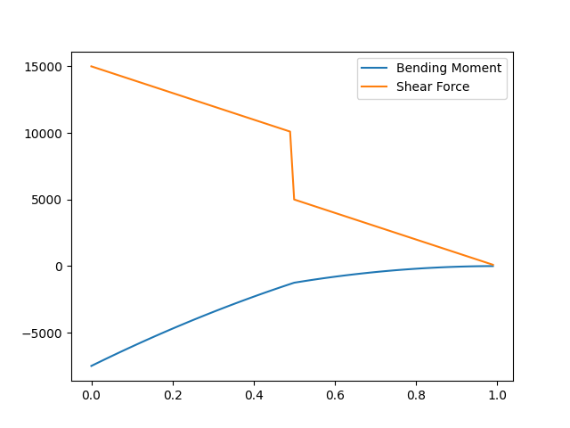
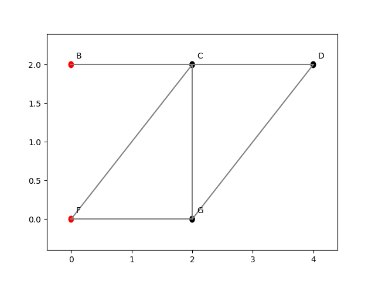

# Aero Calculators

Calculators for the SESA2025 and FEEG2005 modules at the University of Southampton. Includes cross-section, beams, and pin-jointed truss analysis amoung other things.

I coded these myself, example how to use functions based of lecture questions can be seen in the individual files.

I have tried to include docstrings wherever possible

## FEEG2005 - Materials and Structures

### section.py

Calculate properties on 2D cross-sections

#### Cross section area

```{python}
area(points)
```

Area of cross-section using greens theorem

points - an array of (y, z) point pairs

#### Cross section centroid

```{python}
centroid(points)
```

Location of the centroid

points - an array of (y, z) point pairs

#### Moments of inertia around the centroid

```{python}
inertia(points)
```

Moments and product of inertia about centroid

points - an array of (y, z) point pairs

#### Principal moments of inertia and orientation

```{python}
principal(Iyy, Izz, Iyz)
```

Principal moments of inertia and orientation

points - an arraz of (y, z) point pairs

### beam.py

Calculate various properties such as bending stress and moments of a beam

Supports custom point and distributed loads through the use of heaviside functions, bending stress and moments can then be graphed.

```{python}
def bending_shear_force_lecture_1():
    """Example shear force from lecture 1"""
    beam = Beam(1, 24.2 * 10**(-6))
    beam.add_distributed_load(10000, 0, 1)
    beam.add_point_load(5000, 0.5)
    print("R_a", beam.get_R_a())
    print("M_a", beam.get_M_a())

    bending_stress = beam.bending_stress(0, -0.01, -0.1, 6.6 * 10 **-6, 7.2 * 10 **-6, x_value=0)
    print("bending_stress", bending_stress)

    bending_moment = beam.bending_moment()
    shear_force = beam.shear_force()
    x_points = []
    bending_moment_points = []
    shear_force_points = []

    # Enables floating point increments in loops
    def drange(start, stop, step):
        while start < stop:
            yield start
            start += step

    for i in drange(0, 1, 0.01):
        x_points.append(i)
        bending_moment_points.append(bending_moment.subs(x, i))
        shear_force_points.append(shear_force.subs(x, i))

    plt.plot(x_points, bending_moment_points)
    plt.plot(x_points, shear_force_points)

    plt.legend(["Bending Moment", "Shear Force"])
    plt.show()
```

Example Output

```{console}
R_a 15000
M_a -7500.0
bending_stress -50514460.5116797
```



### pin_trusses.py

Can solve pin-jointed trusses using real or virtual energy methods

Force can be appleid at any of the joints

Generates equations using the method of joints and resolves them automatically

Generates truss from an input set of points data and can sketch the truss

```{python}
def virtual_forces_lecture_16():
    """Example question lecture 16, uses a virtual external force"""

    points = [("B", 0, 2, "W"), ("C", 2, 2), ("D", 4, 2),
              ("F", 0, 0, "W"), ("G", 2, 0)]
    members = [("B", "C"), ("C", "D"), ("D", "G"),
               ("F", "G"), ("F", "C"), ("C", "G")]

    A = 1000 * 10**-6
    E = 200 * 10**9

    N = CoordSys3D('N')
    real_force = - 10000 * N.j
    real_point = "D"

    virtual_force = - 1 * N.j
    virtual_point = "G"

    print("""
=====================
    Real Truss
=====================
    """)

    # Apply analysis on real truss in same way as before
    real_truss = Truss(points, members)
    real_truss.add_force_at_point(real_point, real_force)
    real_truss.print_all_eqns()
    real_truss.solve_equation_system()
    real_truss.print_resolved_forces()
    real_elements, headers = real_truss.find_truss_elements(A, E)
    real_truss.plot()
    print("""
Real Truss Elements:
    """)

    print(tabulate(real_elements, headers=headers, disable_numparse=True))

    print("""
=====================
    Virtual Truss
=====================
    """)

    # Make new truss and apply virtual force at point G and solve
    virtual_truss = Truss(points, members)
    virtual_truss.add_force_at_point(virtual_point, virtual_force)
    virtual_truss.print_all_eqns()
    virtual_truss.solve_equation_system()
    virtual_truss.print_resolved_forces()
    virtual_elements = virtual_truss.find_truss_elements(A, E)[0]

    print("""
Virtual Truss Elements:
    """)

    print(tabulate(virtual_elements, headers=headers, disable_numparse=True))

    u = Truss.displacement_arbitrary_point(
        real_elements, virtual_elements, virtual_force)
    print("")
    print("Displacement u at the point G is", u, "as float", u.evalf())
```



Example output

```{console}
=====================
    Real Truss
=====================
    

Equations:
        
B i: 0 = F_BC + Rx_B
B j: 0 = Ry_B
C i: 0 = -F_BC + F_CD - sqrt(2)*F_CF/2
C j: 0 = -sqrt(2)*F_CF/2 - F_CG
D i: 0 = -F_CD - sqrt(2)*F_DG/2
D j: 0 = -sqrt(2)*F_DG/2 - 10000
F i: 0 = sqrt(2)*F_CF/2 + F_FG + Rx_F
F j: 0 = sqrt(2)*F_CF/2 + Ry_F
G i: 0 = sqrt(2)*F_DG/2 - F_FG
G j: 0 = F_CG + sqrt(2)*F_DG/2

Resolving Forces:
        
B j: 0 = Ry_B  |  resolving Ry_B ==> 0
D j: 0 = -sqrt(2)*F_DG/2 - 10000  |  resolving F_DG ==> -10000*sqrt(2)
G i: 0 = -F_FG - 10000  |  resolving F_FG ==> -10000
G j: 0 = F_CG - 10000  |  resolving F_CG ==> 10000
C j: 0 = -sqrt(2)*F_CF/2 - 10000  |  resolving F_CF ==> -10000*sqrt(2)
D i: 0 = 10000 - F_CD  |  resolving F_CD ==> 10000
F i: 0 = Rx_F - 20000  |  resolving Rx_F ==> 20000
F j: 0 = Ry_F - 10000  |  resolving Ry_F ==> 10000
C i: 0 = 20000 - F_BC  |  resolving F_BC ==> 20000
B i: 0 = Rx_B + 20000  |  resolving Rx_B ==> -20000

Resolved Forces:
        
Ry_B = 0
F_DG = -10000*sqrt(2)
F_FG = -10000
F_CG = 10000
F_CF = -10000*sqrt(2)
F_CD = 10000
Rx_F = 20000
Ry_F = 10000
F_BC = 20000
Rx_B = -20000

Real Truss Elements:
    
Member    Force [N]       Length [m]    δ [m]
--------  --------------  ------------  -------
BC        20000           2             0.0002
CD        10000           2             0.0001
CF        -10000*sqrt(2)  2*sqrt(2)     -0.0002
CG        10000           2             0.0001
DG        -10000*sqrt(2)  2*sqrt(2)     -0.0002
FG        -10000          2             -0.0001


=====================
    Virtual Truss
=====================
    

Equations:
        
B i: 0 = F_BC + Rx_B
B j: 0 = Ry_B
C i: 0 = -F_BC + F_CD - sqrt(2)*F_CF/2
C j: 0 = -sqrt(2)*F_CF/2 - F_CG
D i: 0 = -F_CD - sqrt(2)*F_DG/2
D j: 0 = -sqrt(2)*F_DG/2
F i: 0 = sqrt(2)*F_CF/2 + F_FG + Rx_F
F j: 0 = sqrt(2)*F_CF/2 + Ry_F
G i: 0 = sqrt(2)*F_DG/2 - F_FG
G j: 0 = F_CG + sqrt(2)*F_DG/2 - 1

Resolving Forces:
        
B j: 0 = Ry_B  |  resolving Ry_B ==> 0
D j: 0 = -sqrt(2)*F_DG/2  |  resolving F_DG ==> 0
G i: 0 = -F_FG  |  resolving F_FG ==> 0
G j: 0 = F_CG - 1  |  resolving F_CG ==> 1
C j: 0 = -sqrt(2)*F_CF/2 - 1  |  resolving F_CF ==> -sqrt(2)
D i: 0 = -F_CD  |  resolving F_CD ==> 0
F i: 0 = Rx_F - 1  |  resolving Rx_F ==> 1
F j: 0 = Ry_F - 1  |  resolving Ry_F ==> 1
C i: 0 = 1 - F_BC  |  resolving F_BC ==> 1
B i: 0 = Rx_B + 1  |  resolving Rx_B ==> -1

Resolved Forces:
        
Ry_B = 0
F_DG = 0
F_FG = 0
F_CG = 1
F_CF = -sqrt(2)
F_CD = 0
Rx_F = 1
Ry_F = 1
F_BC = 1
Rx_B = -1

Virtual Truss Elements:
    
Member    Force [N]    Length [m]    δ [m]
--------  -----------  ------------  -------
BC        1            2             1e-08
CD        0            2             0
CF        -sqrt(2)     2*sqrt(2)     -2e-08
CG        1            2             1e-08
DG        0            2*sqrt(2)     0
FG        0            2             0

Merged Truss Data:
        
Member    δ Actual[m]    F* Virtual [N]    F* x δ Actual
--------  -------------  ----------------  --------------------
BC        0.0002         1                 0.000200000000000000
CD        0.0001         0                 0
CF        -0.0002        -sqrt(2)          0.0002*sqrt(2)
CG        0.0001         1                 0.000100000000000000
DG        -0.0002        0                 0
FG        -0.0001        0                 0

Displacement u at the point G is 0.0002*sqrt(2) + 0.0003 as float 0.000582842712474619
```

### materials_eqns.py

Materials exam useful sympy equations

## SESA025 - Flight Mechanics

Formula sheet equations as auto-rearrangeable Sympy equations
